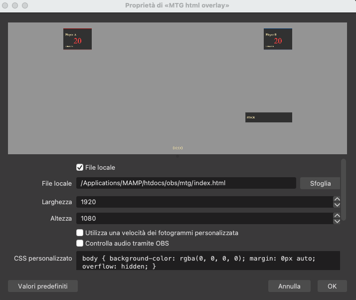
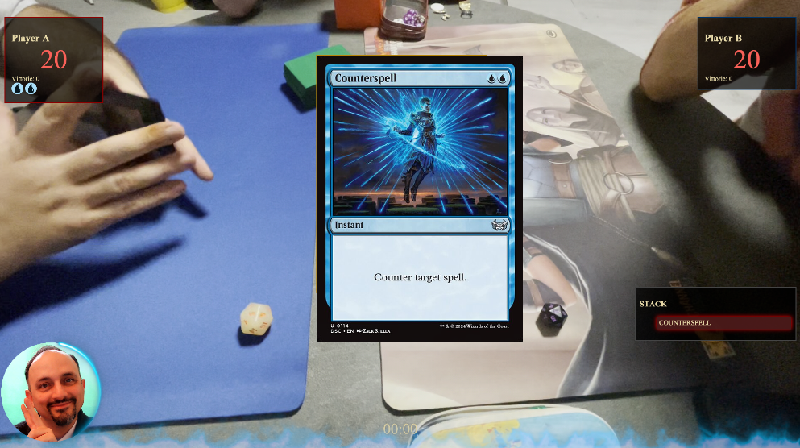

```
██████╗ ██████╗ ███████╗
██╔═══██╗██╔══██╗██╔════╝
██║ ██║██████╔╝███████╗
██║ ██║██╔══██╗╚════██║
╚██████╔╝██████╔╝███████║
╚═════╝ ╚═════╝ ╚══════╝

███╗ ███╗████████╗ ██████╗
████╗ ████║╚══██╔══╝██╔════╝
██╔████╔██║ ██║ ██║ ███╗
██║╚██╔╝██║ ██║ ██║ ██║
██║ ╚═╝ ██║ ██║ ╚██████╔╝
╚═╝ ╚═╝ ╚═╝ ╚═════╝

██████╗ ██╗ ██╗███████╗██████╗ ██╗ ██╗██╗███████╗██╗ ██╗
██╔═══██╗██║ ██║██╔════╝██╔══██╗██║ ██║██║██╔════╝██║ ██║
██║ ██║██║ ██║█████╗ ██████╔╝██║ ██║██║█████╗ ██║ █╗ ██║
██║ ██║╚██╗ ██╔╝██╔══╝ ██╔══██╗╚██╗ ██╔╝██║██╔══╝ ██║███╗██║
╚██████╔╝ ╚████╔╝ ███████╗██║ ██║ ╚████╔╝ ██║███████╗╚███╔███╔╝
╚═════╝ ╚═══╝ ╚══════╝╚═╝ ╚═╝ ╚═══╝ ╚═╝╚══════╝ ╚══╝╚══╝
```

### 🇮🇹 ITALIANO

## INSTALLAZIONE

- Scaricare il progetto.
- Decomprimere il progetto.
- Aprire OBS.
- Creare una nuova Scena.
- Aggiungere una fonte di tipo Browser chiamara: MTG Html OverView
- Spuntare: File locale
- Selezionare il file index.html del progetto
- Larghezza: 1920
- Altezza: 1080s
- Aggiungere nuova fonte di tipo multimediale con il video della partita



## UTILIZZO

- Cliccare sulla fonte Browser del progetto su obs tasto destro del mouse e selezionare: Interagisci
- L'interfaccia si comanda al momento da tastiera con i seguenti comandi:

### COMANDI DA TASTIERA

    | Tasto | Funzione |
    | --- | --- |
    | Q / A | Vita Player A ±      |
    | P / L | Vita Player B ±      |
    | W / O | Win Player A / B     |
    | S     | Aggiungi spell STACK |
    | X     | Svuota STACK         |
    | C     | Card Zoom (URL)      |
    | T     | Start/Stop Timer     |
    | B     | Sideboard Mode       |

    | Tasto | Mana |
    | --- | --- |
    | `1`   | White            |
    | `2`   | Blue             |
    | `3`   | Black            |
    | `4`   | Red              |
    | `5`   | Green            |
    | `6`   | Colorless        |
    | `R`   | **RESET mana A** |

    | Tasto | Mana |
    | --- | --- |
    | `7`   | White            |
    | `8`   | Blue             |
    | `9`   | Black            |
    | `0`   | Red              |
    | `-`   | Green            |
    | `=`   | Colorless        |
    | `I`   | **RESET mana B** |

    | Tasto | Azione |
    | --- | --- |
    | `N`   | Cambia nome Player A |
    | `K`   | Cambia nome Player B |

    | Tasto | Azione |
    | --- | --- |
    | `Z`   | Giocatore 1 Attivo |
    | `M`   | Giocatore 2 Attivo |

## RESETTARE L'INTERFACCIA

- Cliccare sulla fonte HTML OBS del progetto
- Tasto destro selezionare: Proprietà
- In fondo cliccare su: Aggiorna la cache della pagina attuale



🇬🇧 English

## INSTALLATION

- Download the project.
- Extract the project.
- Open OBS.
- Create a new Scene.
- Add a Browser source named: MTG Html OverView
- Check: Local file
- Select the project's `index.html` file
- Width: 1920
- Height: 1080
- Add a new Media Source with the match video


## USAGE

- Right-click on the project Browser source in OBS and select: Interact
- The interface is currently controlled via keyboard using the following commands:

### KEYBOARD COMMANDS

    | Key | Function |
    | --- | --- |
    | Q / A | Player A Life ±    |
    | P / L | Player B Life ±    |
    | W / O | Player A / B Win   |
    | S     | Add spell to STACK |
    | X     | Clear STACK        |
    | C     | Card Zoom (URL)    |
    | T     | Start/Stop Timer   |
    | B     | Sideboard Mode     |

    | Key | Mana |
    | --- | --- |
    | `1` | White       |
    | `2` | Blue        |
    | `3` | Black       |
    | `4` | Red         |
    | `5` | Green       |
    | `6` | Colorless  |
    | `R` | **RESET mana A** |

    | Key | Mana |
    | --- | --- |
    | `7` | White |
    | `8` | Blue |
    | `9` | Black |
    | `0` | Red |
    | `-` | Green |
    | `=` | Colorless |
    | `I` | **RESET mana B** |

    | Key | Action |
    | --- | --- |
    | `N` | Change Player A Name |
    | `K` | Change Player B Name |

    | Key | Action |
    | --- | --- |
    | `Z` | Player 1 Active |
    | `M` | Player 2 Active |

## RESETTING THE INTERFACE

- Click on the OBS HTML source of the project
- Right-click and select: Properties
- At the bottom, click: Refresh cache of current page
